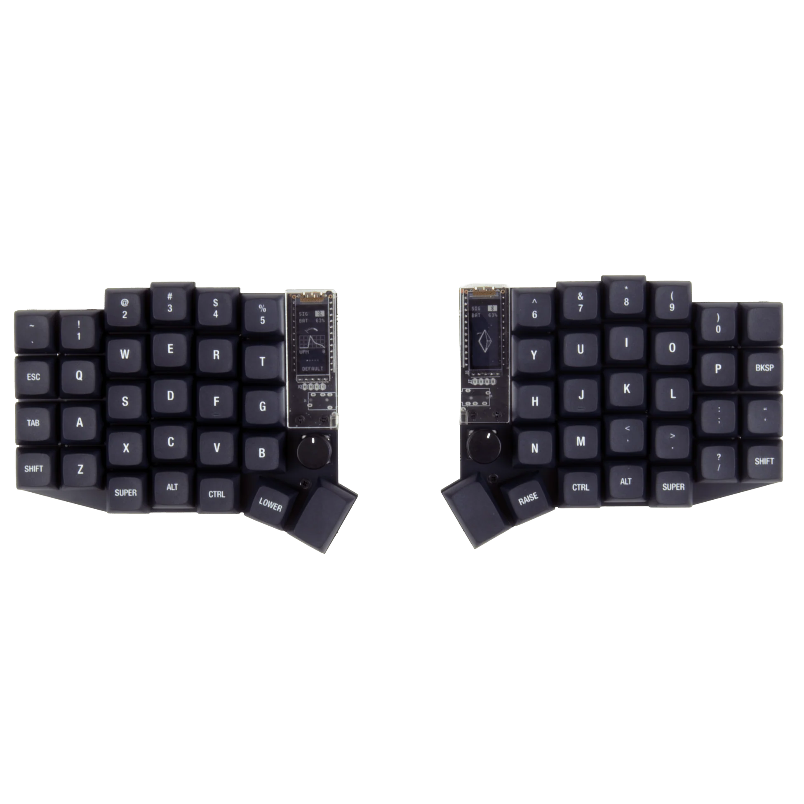
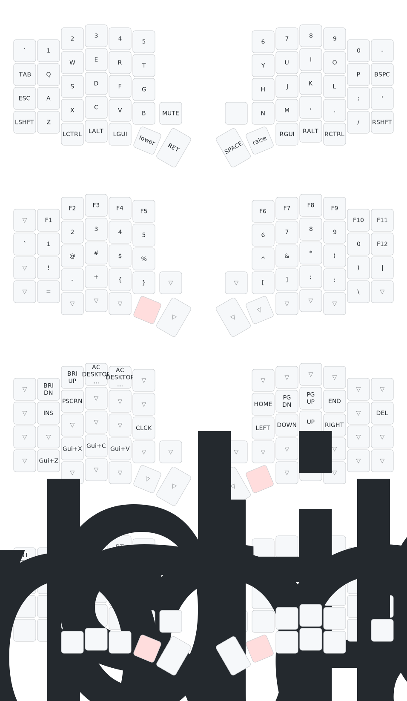

# Sofle v2 ZMK Config

Wireless split keyboard configuration for the Sofle v2, optimized for macOS.

## Hardware

| Component | Details |
|-----------|---------|
| Board | nice!nano v2 (nRF52840) |
| Display | nice!view (MiP/Sharp Memory LCD) |
| Shield | Sofle v2 with nice_view_adapter + nice_view_gem |
| Encoders | 2x rotary (left: volume, right: page scroll) |



## Keymap



### Layer 0: Base

Optimized for macOS with the thumb row mirroring the Mac keyboard modifier order.

```
┌───────┬─────┬─────┬─────┬─────┬─────┐                 ┌─────┬─────┬─────┬─────┬─────┬───────┐
│   `   │  1  │  2  │  3  │  4  │  5  │                 │  6  │  7  │  8  │  9  │  0  │   -   │
├───────┼─────┼─────┼─────┼─────┼─────┤                 ├─────┼─────┼─────┼─────┼─────┼───────┤
│  TAB  │  Q  │  W  │  E  │  R  │  T  │                 │  Y  │  U  │  I  │  O  │  P  │ BKSPC │
├───────┼─────┼─────┼─────┼─────┼─────┤                 ├─────┼─────┼─────┼─────┼─────┼───────┤
│  ESC  │  A  │  S  │  D  │  F  │  G  │                 │  H  │  J  │  K  │  L  │  ;  │   '   │
├───────┼─────┼─────┼─────┼─────┼─────┼─────┐     ┌─────┼─────┼─────┼─────┼─────┼─────┼───────┤
│ SHIFT │  Z  │  X  │  C  │  V  │  B  │MUTE │     │     │  N  │  M  │  ,  │  .  │  /  │ SHIFT │
└───────┴─────┼─────┼─────┼─────┼─────┼─────┤     ├─────┼─────┼─────┼─────┼─────┼─────────────┘
              │CTRL │ OPT │ CMD │LOWER│ENTER│     │SPACE│RAISE│ CMD │ OPT │CTRL │
              └─────┴─────┴─────┴─────┴─────┘     └─────┴─────┴─────┴─────┴─────┘
```

Key design choices:
- **Cmd next to Enter/Space** — matches Mac muscle memory for Cmd+C/V/Z/Tab
- **ESC on home row** — accessible for Vim/IDE use without reaching
- **Minus on top-right** — useful for coding, replaces the empty key

### Layer 1: Lower (Symbols + F-keys)

Hold **LOWER** to access symbols and function keys.

```
┌───────┬─────┬─────┬─────┬─────┬─────┐                 ┌─────┬─────┬─────┬─────┬─────┬───────┐
│       │ F1  │ F2  │ F3  │ F4  │ F5  │                 │ F6  │ F7  │ F8  │ F9  │ F10 │  F11  │
├───────┼─────┼─────┼─────┼─────┼─────┤                 ├─────┼─────┼─────┼─────┼─────┼───────┤
│   `   │  1  │  2  │  3  │  4  │  5  │                 │  6  │  7  │  8  │  9  │  0  │  F12  │
├───────┼─────┼─────┼─────┼─────┼─────┤                 ├─────┼─────┼─────┼─────┼─────┼───────┤
│       │  !  │  @  │  #  │  $  │  %  │                 │  ^  │  &  │  *  │  (  │  )  │   |   │
├───────┼─────┼─────┼─────┼─────┼─────┼─────┐     ┌─────┼─────┼─────┼─────┼─────┼─────┼───────┤
│       │  =  │  -  │  +  │  {  │  }  │     │     │     │  [  │  ]  │  ;  │  :  │  \  │       │
└───────┴─────┼─────┼─────┼─────┼─────┼─────┤     ├─────┼─────┼─────┼─────┼─────┼─────────────┘
              │     │     │     │█████│     │     │     │     │     │     │     │
              └─────┴─────┴─────┴─────┴─────┘     └─────┴─────┴─────┴─────┴─────┘
```

### Layer 2: Raise (Navigation + macOS)

Hold **RAISE** for navigation, media, and macOS shortcuts.

```
┌───────┬─────┬─────┬─────┬─────┬─────┐                 ┌─────┬─────┬─────┬─────┬─────┬───────┐
│       │ BRI-│ BRI+│MSCTL│LNCHP│     │                 │     │     │     │     │     │       │
├───────┼─────┼─────┼─────┼─────┼─────┤                 ├─────┼─────┼─────┼─────┼─────┼───────┤
│       │ INS │PSCRN│     │     │     │                 │HOME │PGDN │PGUP │ END │     │  DEL  │
├───────┼─────┼─────┼─────┼─────┼─────┤                 ├─────┼─────┼─────┼─────┼─────┼───────┤
│       │     │     │     │     │CAPS │                 │  ←  │  ↓  │  ↑  │  →  │     │       │
├───────┼─────┼─────┼─────┼─────┼─────┼─────┐     ┌─────┼─────┼─────┼─────┼─────┼─────┼───────┤
│       │⌘+Z  │⌘+X  │⌘+C  │⌘+V  │     │     │     │     │     │     │     │     │     │       │
└───────┴─────┼─────┼─────┼─────┼─────┼─────┤     ├─────┼─────┼─────┼─────┼─────┼─────────────┘
              │     │     │     │     │     │     │     │█████│     │     │     │
              └─────┴─────┴─────┴─────┴─────┘     └─────┴─────┴─────┴─────┴─────┘
```

Key features:
- **Arrow keys on HJKL** — Vim-style navigation on the right home row
- **macOS shortcuts** — Cmd+Z/X/C/V on left bottom row
- **Media keys** — Brightness, Mission Control, Launchpad on top row

### Layer 3: Adjust (System — hold LOWER+RAISE)

Hold **both LOWER and RAISE** to access Bluetooth and system controls.

```
┌───────┬─────┬─────┬─────┬─────┬─────┐                 ┌─────┬─────┬─────┬─────┬─────┬───────┐
│BT CLR │ BT1 │ BT2 │ BT3 │ BT4 │ BT5 │                 │     │     │     │     │     │CLRALL │
├───────┼─────┼─────┼─────┼─────┼─────┤                 ├─────┼─────┼─────┼─────┼─────┼───────┤
│EP TOG │     │     │     │     │     │                 │     │     │     │     │     │       │
├───────┼─────┼─────┼─────┼─────┼─────┤                 ├─────┼─────┼─────┼─────┼─────┼───────┤
│       │     │     │     │     │     │                 │     │     │     │     │     │       │
├───────┼─────┼─────┼─────┼─────┼─────┼─────┐     ┌─────┼─────┼─────┼─────┼─────┼─────┼───────┤
│ RESET │BOOTL│     │     │     │     │     │     │     │     │     │     │     │BOOTL│ RESET │
└───────┴─────┼─────┼─────┼─────┼─────┼─────┤     ├─────┼─────┼─────┼─────┼─────┼─────────────┘
              │     │     │     │█████│     │     │     │█████│     │     │     │
              └─────┴─────┴─────┴─────┴─────┘     └─────┴─────┴─────┴─────┴─────┘
```

- **BT1-BT5** — Switch between 5 paired Bluetooth devices
- **BT CLR** — Clear current profile bond | **CLR ALL** — Clear all bonds
- **RESET/BOOTL** — System reset and bootloader mode (bottom corners, both sides)
- **EP TOG** — Toggle external power

## Encoders

| Encoder | Action |
|---------|--------|
| Left (all layers) | Volume Up / Down |
| Right (all layers) | Page Up / Down |

## Building

Push to GitHub and the Actions workflow will build firmware automatically. Download the artifact zip containing:
- `sofle_left nice_view_adapter nice_view_gem-nice_nano_v2-zmk.uf2` — left half
- `sofle_right nice_view_adapter nice_view_gem-nice_nano_v2-zmk.uf2` — right half

## Flashing

1. Connect half via USB
2. Double-tap the reset button (or use BOOTL key on Adjust layer)
3. Drag the corresponding `.uf2` file to the `NICENANO` drive
4. Repeat for the other half

## ZMK Studio

The left half has ZMK Studio enabled. Connect via USB and visit [zmk.studio](https://zmk.studio) to edit keymaps at runtime without reflashing.
